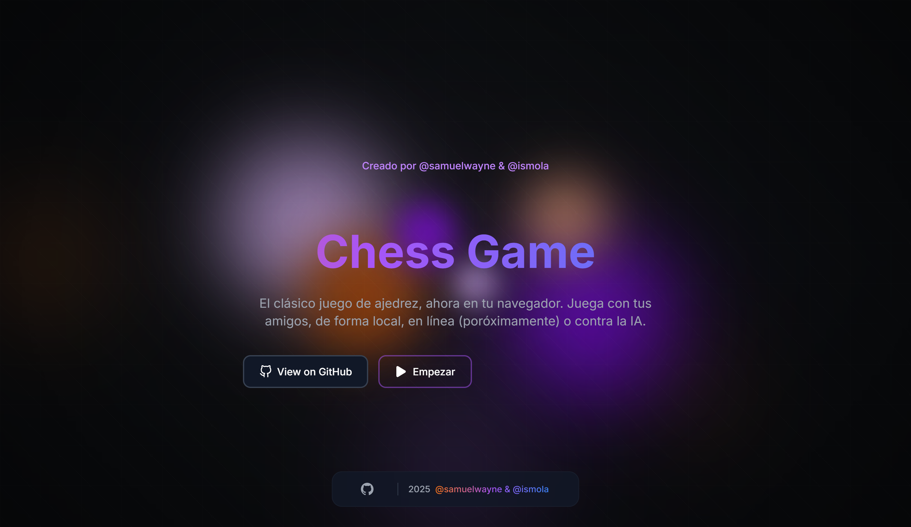

# 🚀 Chess Game Client


> [!WARNING]  
> Project still in development

[](https://app.netlify.com/sites/luminous-caramel-e13cce/deploys)




**Access Link:** [https://chessgame.ismola.dev/game/](https://chessgame.ismola.dev/)

**Template Used:** [UltimateAstroTemplate](https://github.com/Marve10s/UltimateAstroTemplate)

---

## 📖 Description

This project is an online chess game client developed using the [UltimateAstroTemplate](https://github.com/Marve10s/UltimateAstroTemplate). The goal is to provide a smooth and engaging chess-playing experience for users, with an intuitive interface and modern features.

---

## 🛠️ Technologies Used

- **Frontend:** 
  - Astro
  - React
  - Tailwind CSS
- **Backend:** (If applicable)
  - Node.js
  - Express
- **Other Tools:**
  - Vite
  - ESLint
  - Prettier

---

## 🚀 How to Run the Project Locally

Follow these steps to set up and run the project on your local machine:

1. **Clone the repository:**
   ```bash
   git clone https://github.com/Ismola/fork-Marve10s-UltimateAstroTemplate
   cd chess-game-client
   ```

2. **Install dependencies:**
   ```bash
   npm install
   ```

3. **Start the development server:**
   ```bash
   npm run dev
   ```
4. **Open the project in your browser:**
   * Visit http://localhost:3000 to see the application in action.


## 🎯 Key Features
* **Modern User Interface**: Clean and responsive design.
* **Real-Time Gameplay**: Play chess in real-time with other players.
* **Standard Chess Rules**: Full implementation of standard chess rules.
* **Customization**: Options to customize the board and pieces.

